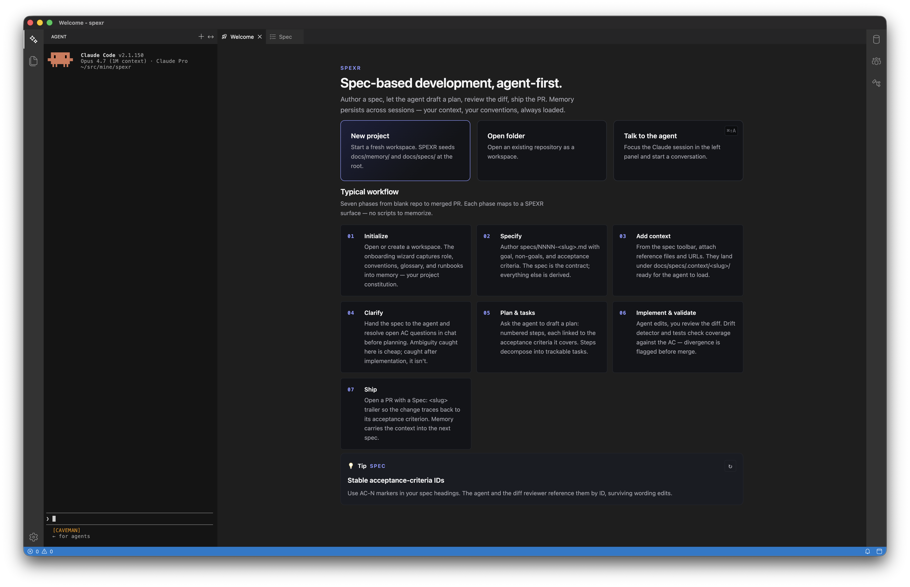
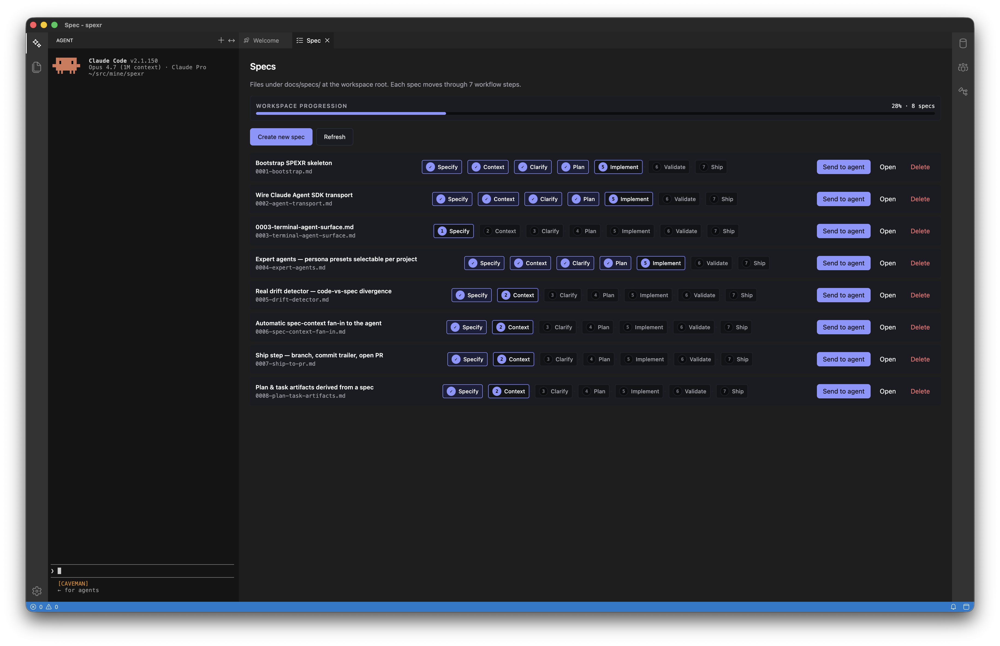
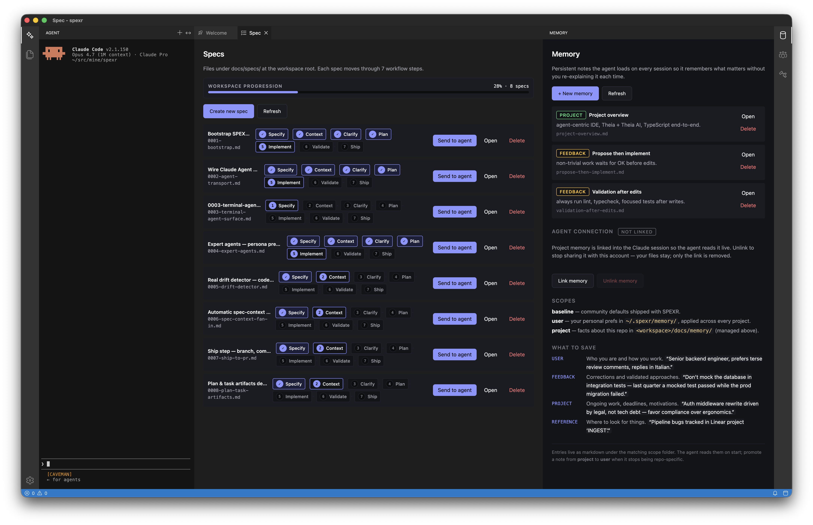
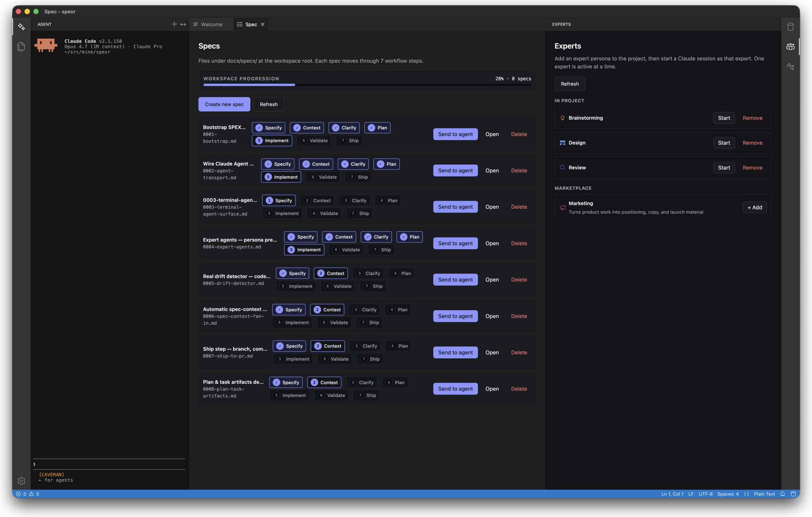

# SPEXR

Agent-centric, spec-based IDE. Built on **Eclipse Theia** + **Theia AI**, fully TypeScript.

> **Status: v0.1.0 — public beta.** Packaged installers available on the [Releases page](https://github.com/marcellobarile/spexr-ide/releases). Core spec workflow complete. On-disk formats stable; minor API changes possible before 1.0.

## Why

Most editors bolt an agent into a sidebar. SPEXR inverts the layout: the Claude session is the primary surface, source files and terminals orbit around it. Specs are first-class artifacts — every change traces back to an acceptance criterion.

## Pillars

1. **Agent-primary shell** — a Claude session starts on workspace open and is the main surface, not a panel.
2. **Spec-driven flow** — `docs/specs/<NNNN-slug>.md` → plan → tasks → diff → PR. A drift detector flags divergence.
3. **Two-scope memory** — `~/.spexr/memory/` (user) + `<workspace>/docs/memory/` (project). Frontmatter-tagged markdown, indexed in `MEMORY.md`. Promote/demote between scopes.
4. **Onboarding wizard** — first session asks for internal docs (architecture, conventions, glossary, runbooks); answers become memory.
5. **Community best-practices baseline** — language/framework guidance pre-loaded, override-able per scope.
6. **Themeable, accessible UI** — WCAG 2.1 AA via Radix primitives + design tokens (CSS vars). Light, dark, high-contrast presets + custom JSON themes.

## Screenshots

> Pre-alpha UI — these might change.

**Welcome**



**Specs + agent**



**Memory**



**Experts**



---

## For adopters

### Requirements

| Requirement | Notes |
|---|---|
| **Claude Code CLI installed & authenticated** | **Hard dependency.** SPEXR does not call the Anthropic API directly — it spawns your locally installed `claude` binary and reuses its stored credentials (`~/.claude`). No `ANTHROPIC_API_KEY` is read. A missing or ambiguous binary is a blocking error. |
| Node.js ≥ 22.17.0 | `.nvmrc` pins the dev version; `nvm use` picks it up. |
| pnpm ≥ 9 | `corepack enable` is enough; the repo pins `pnpm@9.12.0`. |
| Git | Required for the spec → diff → PR flow. |

Verify the CLI before launching SPEXR:

```bash
claude --version     # must resolve on your PATH (or set spexr.claude.executablePath)
```

If you launch `claude` through a shell alias that sets `CLAUDE_CONFIG_DIR` (e.g. multiple Claude profiles), SPEXR detects it on workspace open and, when more than one profile exists, prompts once per project and remembers your choice.

### Install from a release (recommended)

Download the latest installer from the [Releases page](https://github.com/marcellobarile/spexr-ide/releases).

#### macOS

1. Download `SPEXR-<version>-mac-arm64.dmg` (Apple Silicon) or `SPEXR-<version>-mac-x64.dmg` (Intel).
2. Open the DMG and drag **SPEXR** to **Applications**.
3. **First launch only:** macOS blocks unsigned apps. Right-click the app icon → **Open** → **Open** in the dialog. After that, double-click works normally.

> SPEXR is not yet notarized by Apple. The "right-click → Open" step is a one-time workaround until code signing is set up.

#### Windows

1. Download `SPEXR-<version>-win-x64.exe` (NSIS installer).
2. Run the installer. If Windows SmartScreen warns "Unknown publisher", click **More info → Run anyway**.
3. SPEXR appears in the Start menu.

> Windows may show a SmartScreen warning because the binary is not yet code-signed.

#### Linux

**AppImage (any distro):**
```bash
chmod +x SPEXR-<version>-linux-x64.AppImage
./SPEXR-<version>-linux-x64.AppImage
```

**Debian / Ubuntu:**
```bash
sudo dpkg -i SPEXR-<version>-linux-x64.deb
# then launch via Applications menu or:
spexr
```

---

### Run from source

Requires Node.js ≥ 22.17.0 and pnpm ≥ 9.

```bash
nvm use
pnpm setup        # installs deps, rebuilds Electron native modules, builds packages
pnpm dev          # build + launch
```

On first launch the onboarding wizard seeds project memory. Open any folder as your workspace; the Claude session starts automatically.

### Build installers locally

```bash
pnpm package           # current OS
pnpm package:mac       # dmg + zip (x64 + arm64)  — requires macOS
pnpm package:win       # nsis + zip (x64)          — requires Windows or Wine
pnpm package:linux     # AppImage + deb (x64)
```

Output: `apps/desktop/dist-installers/`. Config: `apps/desktop/electron-builder.yml`.

### How your workspace is laid out

SPEXR writes spec and memory files under a `docs/` container at the workspace root, grouped and away from source folders:

```
<your-workspace>/
└── docs/
    ├── agents/           Installed expert personas (<id>.md)
    ├── memory/           Project-scope memory (markdown + MEMORY.md index)
    └── specs/            NNNN-<slug>.md spec files
        └── .context/     Per-spec supporting material
            └── <NNNN-slug>/
                ├── _links.md         External URLs (briefings, docs, references)
                └── <copied-files>    Local files copied as context
```

User-scope memory stays under `~/.spexr/memory/`.

> **Naming collision, accepted trade-off:** if your project already uses `docs/specs/` or `docs/memory/` for something else, SPEXR writes into the existing folder rather than creating a separate namespace. Rename your folders or pre-seed SPEXR's files if you need both.

### Spec context

Each spec can carry its own knowledge base — kickoff briefs, customer feedback, design notes, reference URLs — kept separate from the spec body, under `docs/specs/.context/<NNNN-slug>/`.

- **From the Spec view** — open a spec; the tab toolbar exposes:
  - **Send to agent** (rocket icon) — hands the spec body to the Claude session.
  - **Add context** (library icon) — quick pick:
    - *From file…* — copies one or more local files into `.context/<slug>/`. Filename collisions get a `-2`, `-3` suffix.
    - *From URL…* — appends `- [label](url) — YYYY-MM-DD` to `.context/<slug>/_links.md`.
- **From the Spec list panel** — every spec offers *Send to agent* (primary) and *Open* (secondary).

Context is storage-only for now: files and links sit next to the spec, ready for the agent to load on a future handoff.

---

## For contributors

### Repository layout

```
SPEXR/
├── apps/
│   └── desktop/          Electron shell (Theia) — no source, only DI wiring & packaging
├── packages/
│   ├── core/             DI, config, logger, paths
│   ├── ui-kit/           Design tokens, themes, Radix wrappers
│   ├── memory/           Scope manager, markdown index
│   ├── spec/             Spec parser, plan/task pipeline, drift detector
│   ├── agent/            Claude session lifecycle, prompt builder, expert catalog (Theia-agnostic)
│   ├── onboarding/       Wizard state machine
│   └── theia-extensions/ Theia binding: src/node backend + src/browser frontend proxy
└── docs/
    ├── memory/           Project-scope memory (dogfood, flat layout)
    └── specs/            Specs as first-class artifacts (NNNN-<slug>.md)
```

**Architecture rule:** `@spexr/agent` (and the other `packages/*`) stay Theia-agnostic. All Theia DI bindings live in `@spexr/theia-extensions`; `apps/desktop` carries no business logic. The agent runs in the Theia backend (node) and streams to the frontend over JSON-RPC.

### Stack

- TypeScript strict
- Eclipse Theia + Theia AI
- React (provided by Theia) + Radix UI primitives + Tailwind
- Claude Agent SDK (`@anthropic-ai/claude-agent-sdk`), wired to the **local Claude Code CLI** as its transport
- pnpm workspaces + Turborepo
- Vitest, ESLint flat, Prettier

### Dev loop

```bash
pnpm dev:watch    # seed a build, then run every package watcher (tsc) + webpack bundle watcher + Electron together; Ctrl+C stops all
```

- **Frontend / command / UI changes** → after watchers rebuild `lib/` and re-bundle, reload the window (`Cmd/Ctrl+R`). No restart.
- **Backend / `electron-main` changes** → restart (`pnpm dev:watch`); Electron has no backend hot-reload.

Other commands:

```bash
pnpm build        # build all packages (turbo)
pnpm start        # launch Electron against the current build
pnpm lint         # ESLint, all packages
pnpm typecheck    # tsc --noEmit, all packages
pnpm test         # Vitest, all packages
pnpm format       # Prettier write
```

DevTools are off by default. To open the Electron DevTools on each window:

```bash
SPEXR_DEVTOOLS=1 pnpm start
```

### Localization

UI strings go through Theia's i18n: `nls.localize("spexr/<area>/<key>", "English default", ...args)`. **English is the default** and renders with no language pack — the second argument is the fallback. No other languages ship today; add one by registering a Theia `LocalizationContribution` (backend) for the existing `spexr/*` keys — call sites don't change.

### Contributing workflow

SPEXR dogfoods its own spec-driven flow:

1. **Start from a spec.** Add or pick one in `docs/specs/NNNN-<slug>.md` with frontmatter (`slug`, `title`, `status`, `createdAt`) and **acceptance criteria** (`AC-N`). Every change traces back to an AC.
2. **Branch** off the default branch — never commit to it directly.
3. **Implement** in the right package; keep `packages/*` Theia-agnostic and Theia bindings in `@spexr/theia-extensions`.
4. **Validate** before review: `pnpm lint && pnpm typecheck && pnpm test`. Bug fixes get a regression test; tricky logic gets tests first.
5. **Keep specs honest.** When behavior supersedes an AC, mark it (strike-through + pointer to the new AC) rather than deleting history — see `docs/specs/0002-agent-transport.md`.
6. **Open a PR** against the AC it satisfies. Humans handle commits and merges.

Conventions: TypeScript strict, no dead code or speculative abstractions, comments only for non-obvious *why*, follow the surrounding style (`.editorconfig` + `.prettierrc.json` are authoritative). `pnpm format` before pushing.

---

## Roadmap

Specs `0001`–`0010` are implemented and shipped in v0.1.0. Open a spec in `docs/specs/` to see its acceptance criteria and status — they are the live roadmap.

**Shipped in v0.1.0** — full spec → PR loop:

| Spec | What |
|---|---|
| `0001` | Bootstrap — Theia shell, agent terminal, memory panel |
| `0003` | Terminal agent surface — embedded Claude session |
| `0004` | Expert personas — built-in catalog, per-step auto-activation |
| `0005` | Drift detector — agent evaluates AC coverage vs. code |
| `0006` | Spec context fan-in — attached files fed to agent on handoff |
| `0007` | Ship → PR — commit + push + `gh pr create` in one step |
| `0008` | Plan & task artifacts — checklist from spec AC, tickable in UI |
| `0009` | Live spec validation — lint panel, tab badge |
| `0010` | Markdown preview — split-right live preview |

**Next — net-new directions** (not yet specced):

- **MCP / tool-use registration** — per-project MCP servers exposed to the spawned CLI.
- **Custom & shareable experts** — author/import experts beyond the built-in catalog.
- **Cost & usage tracking** — token/cost per spec and session from the local CLI.
- **Mac notarization** — remove the "right-click → Open" first-launch step.
- **Concurrent expert sessions** — more than one agent terminal side by side.

## License

MIT. See [`LICENSE`](LICENSE).
